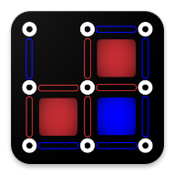

  
	

 
	<h1 align="center"> Dots And Boxes </h1>  

	
 
		 <b> Dots & Boxes Android Mobile Game (Casual) </b> 
	

	The game mechanics was originally modeled in Vienna Development Model (VDM) using Overture. Upon validation, the game was designed and programmed using Java - following the Mobile Application Development Cycle (see hyperlinks below this). The app was designed with the key idea to make each and every option within the game customizable whilst keeping to the Android Material Design.

	<h4>
		<a href="/PDFs/Business Case.pdf">Business Case</a>  • 
		<a href="/PDFs/Font Board.pdf">Font Board</a> •
		<a href="/PDFs/Mood Board.pdf">Mood Board</a> •
		<a href="/PDFs/User Stories.pdf">User Stories</a>
	</h4>

	 
	
	

  <a href="#features">Features</a> •
  <a href=#storyboard--ux-design>UX Design</a> •
  <a href="#support">Support</a>

## Features
- Variable Game Options/Settings:
	- Board/Grid Size
	- Number of Players - Unlimited (Limited only by choosen board size)
		- No. AI Players
		- No. Human Players
	- Optional Hints
	- Optional Undo(s)
		- Supports Undo(s) for AI moves too
	- Quick Mode
		- AI moves/turns completes immediately (without human response time delay) - useful if large no. of AI players.
	- Randomize Turns
		- Shuffles all turns (player's and AI turns are not in order)
		- Meaning that AI could potentially play as 1st turn (randomized)
	- P1Starts
		- Fixes that Player 1 will start regardless of randomized turns

#### Todo/Partial Implementations:
- Themeable Interface
- Achievements
- Add option to such that undo(s) only work on player moves (option disabling AI moves undo(s))
- Google Play Support
- Game board Design Changes

#### Future Work:
- Game Tutorial
- Online Multiplayer Support
- Multiple AI Difficulties Levels
- Customizable Player Colors
- Handicapped starts / Optional partially filled game board
- Google PlayStore Release
- Different GameBoard Design Choices
- Potential inclusion of 3D game board

  
	
	

### App Images

#### StoryBoard / UX Design

[//]: # ()

## How To Play:
- [WikiHow Dots & Boxes](https://www.wikihow.com/Play-Dots-and-Boxes)
- [Try Dots & Boxes Online here](http://www.papg.com/show?1TMU)
- [How to always win at Dots and Boxes](https://www.youtube.com/watch?v=KboGyIilP6k)

**Note:** This is ongoing development/work not yet ready for a public release - however it is fully functional

## Support

Reach out to me at one of the following places!

- Email at DotsNBoxes@djothi.com (specific for this repo)
- Email at Github@djothi.com

